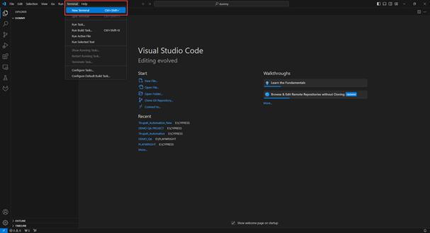
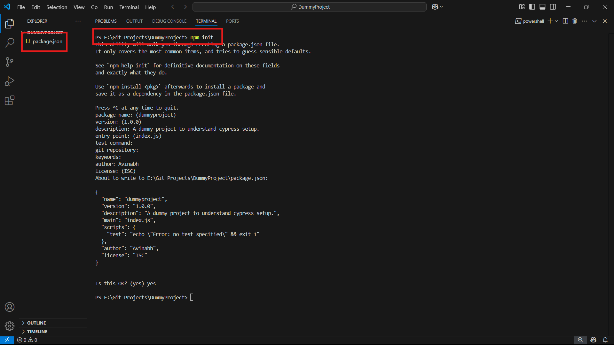
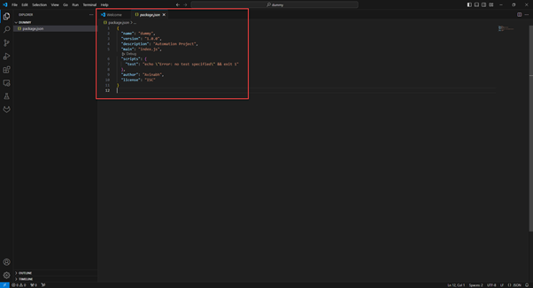
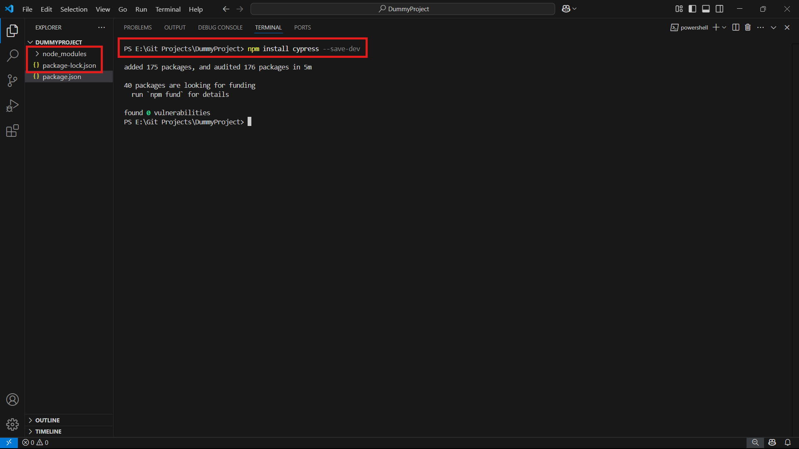
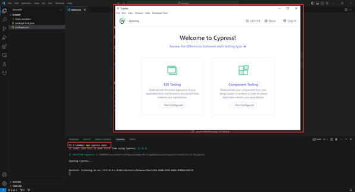
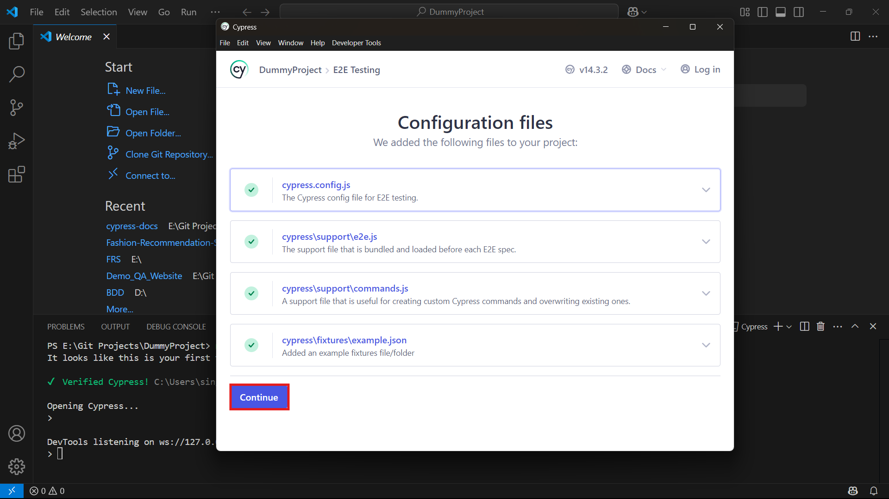
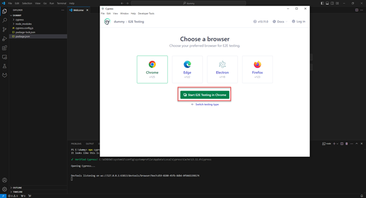

# ⚙️ Installing Cypress: A Step-by-Step Guide

Installing Cypress is a straightforward process. Below are the steps to help you get started.

---

## 🧰 1. Prerequisites

Make sure the following tools are installed and configured on your system before installing Cypress:

- **Node.js**  
  Download and install from [https://nodejs.org](https://nodejs.org), then ensure it's added to your system's environment variables.

- **Visual Studio Code (VSCode)**  
  Install the stable version of [VSCode](https://code.visualstudio.com/).

### ⚠️ Common Issue: `chcp` Variable Not Found

If you encounter an error related to the `chcp` command not being recognized in the terminal:

1. Search for `chcp.exe` on your system (usually in `C:\Windows\System32\`).
2. Copy its path.
3. Add the copied path to your system's **Environment Variables > Path** section.

---

## 🖥️ 2. Setting Up the Project in VSCode

Follow these steps to begin a new Cypress project in VSCode:

#### a. Create a Project Folder

Create a new folder anywhere on your system where your Cypress project will reside.

#### b. Open the Folder in VSCode

Launch VSCode and open the newly created folder:
- `File` > `Open Folder` > `Folder Name`

#### c. Open the Terminal

Access the terminal within VSCode:
- `Terminal` > `New Terminal`



#### d. Initialize npm

Run the following command in the terminal to initialize a Node.js project:

```bash
npm init
```

This will prompt you to provide basic information for your project. You'll be asked to input the following details:

- **Package Name**: 
    Enter the desired name for your project.

- **Description**
    A brief description of your project.

- **Keywords**
    Optional: Keywords relevant to your project (separate with commas).

- **Author Name**
    You can enter your name or leave it blank.

> **Note**: You can leave these fields empty or accept the default values by pressing Enter.
 
At the end of the process, you will be asked to confirm the details you entered. Type 'yes' and press Enter to proceed.

#### e. Verify `package.json` Creation
After completing the above steps, a package.json file should be created in your project directory. This file contains essential metadata about your project and its dependencies.



Below is a sample view of `package.json` file.



#### f. Troubleshooting
If the package.json file is not created:

- Repeat the above steps again.
- Check for any errors in the terminal or console.
- Ensure you’re in the correct directory and the terminal has appropriate permissions.

---

#### 📄 [Question: Why we create ‘package.json’ file?]

**Answer -** This file serves several important purposes:

1. **Dependency Management**  
   `package.json` serves as a manifest for your project's dependencies, including Cypress itself and any other npm packages your project relies on. It lists all the packages needed to run your project, along with their versions. This ensures that everyone working on the project has access to the same dependencies.

2. **Version Control**  
   By specifying dependencies in `package.json`, you can easily track and manage changes to your project's dependencies over time. This is particularly useful when collaborating with other developers or when deploying your project to different environments.

3. **Scripts**  
   `package.json` allows you to define custom scripts that can be executed via npm.

4. **Project Metadata**  
   `package.json` contains metadata about your project, such as its name, description, author, and license information. This metadata provides important context about your project and helps others understand its purpose and usage.

---

## 📥 3. Downloading Cypress

Once your `package.json` is created, navigate back to terminal and execute the following:


#### i. Local Installation:

This command installs Cypress locally as a development dependency for the particular project.

```bash
npm install cypress --save-dev
```

Cypress will start downloading. Once complete, the following files/folders will be automatically created in your project directory:

**1. node_modules**
This is a standard directory in all Node.js projects. It contains all the npm packages and their dependencies required for your project — including Cypress and any utilities it depends on.

**2. package-lock.json**
This file locks the specific versions of installed packages, ensuring consistent installations across different environments and helping avoid version conflicts. Additionally, it speeds up dependency installation by providing npm with pre-determined versions, reducing resolution time.




#### ii. Global Installation:

This command installs Cypress globally within the user's system. 

```bash
npm install -g cypress
```

> **Note**: Installing Cypress globally is not recommended as each project can have its own version of Cypress with its own set of dependencies, thus avoiding potential conflicts between projects. Global installations are generally reserved for tools that are used across multiple projects and don't require project-specific dependencies or configurations.

---

## 🛠️ 4. Cypress Setup and Execution Guide

After successfully installing Cypress, follow the steps below to open and configure it for the first time:

#### a. Launch Cypress Test Runner

1. Open the terminal in your project directory and execute:
   ```bash
   npx cypress open
   ```

2. This will open the Cypress User Interface (UI).

You’ll see two options: E2E Testing and Component Testing — both are initially not configured.



3. Click on **E2E Testing**.  

4. You should now see the configuration files listed. Also, a cypress folder will be automatically created in your project directory.

5. Click on the **Continue** button to let Cypress auto-configure your project.



6. Once configuration is done, select a browser of your choice and click **Start E2E Testing**.

