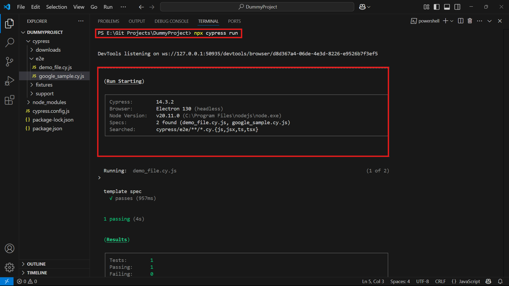
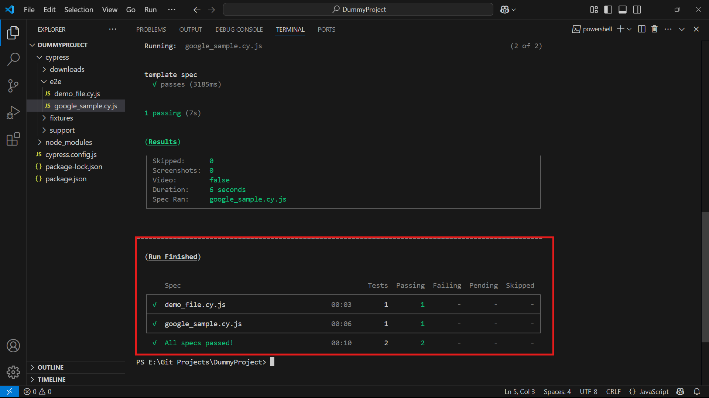
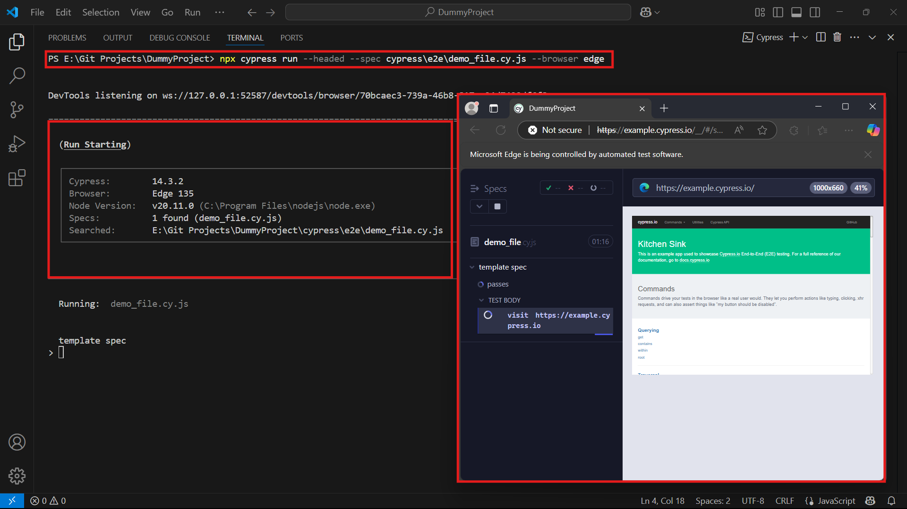

# 🖥️ Commands for Cypress Execution

Use the following commands to run your Cypress tests based on your needs:

---

### 1. Run All Spec Files (Headless - Default Electron)

```bash
npx cypress run
```





> **Note:** Runs all tests in headless mode using the Electron browser.

---

### 2. Run a Specific Spec File (Headless)

```bash
npx cypress run --spec cypress\e2e\demo_file.cy.js
```


> **Note:** Replace the path with your spec file’s relative path.

---

### 3. Run a Specific Spec File in a Specific Browser (Headless)

```bash
npx cypress run --spec cypress\e2e\demo_file.cy.js --browser chrome
```


> **Note:** Available browsers: `chrome`, `electron`, `firefox`, `edge`

---

### 4. Run All Spec Files in a Specific Browser (Headless)

```bash
npx cypress run --browser edge
```


---

### 5. Run a Specific Spec File With Browser UI (Headed)

```bash
npx cypress run --headed --spec cypress\e2e\demo_file.cy.js --browser chrome
```



> **Note:** `--headed` opens the browser instead of running in the terminal.

---

### 6. Run All Spec Files With Browser UI (Default Electron)

```bash
npx cypress run --headed
```


---
