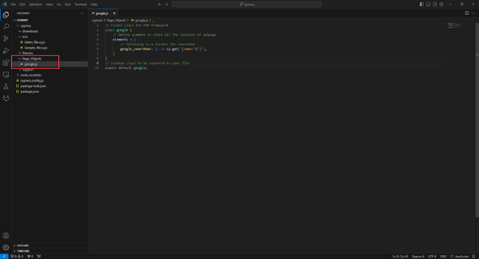
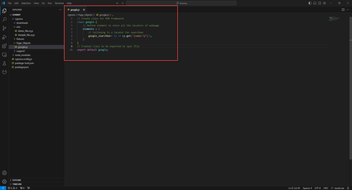

# 📄 What is the POM Framework?

POM stands for **Page Object Model**, a design pattern commonly used in test automation to enhance the structure and maintainability of test code. It works by creating an abstraction of web pages so that the test logic is separated from the UI structure.

In a Cypress-based POM framework, each page or component of the application is represented by its own file. These **Page Object** files include:
- **Selectors** (locators) for the page elements
- **Reusable methods** for interacting with those elements

Test scripts interact with these methods instead of directly referencing selectors. This keeps the test code clean and easy to understand.

---

### ✅ Benefits of Using POM in Cypress:
- **Maintainability**: If the UI changes, only the page object file needs to be updated—not every test.
  
- **Reusability**: Common interactions (like logging in) can be reused across multiple test cases.

- **Readability**: Tests are more readable because they use descriptive method names rather than raw selectors.

- **Scalability**: As the application grows, the organized structure makes it easier to scale test coverage.

---

### 📁 Typical Structure:
- `cypress/pages/` – contains page object files
- `cypress/e2e/` – contains test scripts

This structure improves collaboration among team members by providing a clear separation of concerns: developers and testers can focus on writing test logic, while updates to locators are handled within the page object files.

In summary, implementing the POM framework in Cypress leads to a cleaner, more robust, and scalable automation test suite.

---


## 🧩 Implementation of POM Framework in Cypress

Follow the steps below to implement the **Page Object Model (POM)** framework in your Cypress project:

#### 1. Create the Page Objects Directory

Inside your Cypress project, create a folder named:

`cypress/Page_Objects`

> **Note:** This folder will store all your page object files.

---

#### 2. Create a JavaScript Page Object File

Within the `Page_Objects` folder, create a JavaScript file corresponding to the web page or component. For example:

`google.js`



> **Note:** Make sure the file has a `.js` extension.

---

#### 3. Define UI Locators and Reusable Methods

Inside `google.js`, define:
- **Element locators** (selectors)
- **Reusable methods** (for interactions you perform often)



This helps in keeping your test logic clean and DRY (Don't Repeat Yourself).

---

#### 4. Export and Import Page Object Class

Export the class from your `GooglePage.js` file using ES6 syntax:

```js
export default new GooglePage();
```

Then, import it into your test spec file (e.g., sample_file.cy.js) like this:

```js
import google from '../../pageobjects/GooglePage';
```

This allows you to directly use the `google` object to access methods and locators from the page object file.


##### Why We Use ES6 (ECMAScript 6) ?

In our Cypress project, we use ES6 syntax (e.g., export default, import) to structure code in a clean and modern way. ES6 helps us:

- Keep files modular and organized using import/export.

- Write more readable and reusable code.

- Leverage features like classes, arrow functions, and constants for better maintainability.

Most modern tools and browsers support ES6, making it a best practice for automation frameworks like Cypress.

---

#### 5. Use OOP Principles

Since we exported an instance of the class, we don’t need to create a new object. We can directly use the imported `google` instance:

```js
google.search('Cypress Testing');
google.validateTitle('Cypress');
```

This approach promotes reusability and follows object-oriented programming principles.

---

#### 6. View Test Execution Result

Once the test is executed, Cypress will show the test run summary which includes:

Status: Pass / Fail

Execution time

Step-by-step commands run in the browser
