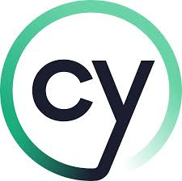

  

# 📘 Cypress Automation Guide

Welcome! This guide will walk you through everything from understanding Cypress to automating tests, using Page Object Model, generating reports.

---

## 📚 Table of Contents

1. [Getting Started with Cypress](./01-what-is-cypress.md)
2. [Installing Cypress: A Step-by-Step Guide](./02-installing-cypress.md)
3. [Running Cypress Tests: CLI & UI](./03-executing-tests.md)
4. [Understanding the Page Object Model (POM)](./04-what-is-pom.md)
5. [Implementing POM Framework in Cypress](./05-implementing-pom.md)
6. [Generating Test Reports in Cypress](./06-generating-reports.md)

---

Each section includes examples, code snippets, and best practices to help you build solid Cypress test automation skills.